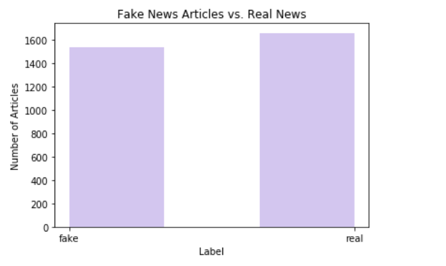

# Detecting Fake News Through Natural Language Processing
by: Natalie Del Rossi, Minna Fingerhood

-----------------------------------
Outline: 
1. Motivation
2. Project
    a. clean data
    b. exploratory data analysis (EDA)
    c. modeling 
3. Follow-up & Improvements

--------------------------------------------

1. Motivation: With the 2020 election around the corner, we must do everything we can do protect the integrity of American Democracy. The 2016 election highlighted new weaknesses in our society, perhaps created by the new role of technology and social media in our politics. As a safeguard to our next election, we must curb the spread of "Fake News" and provide the public with trustworthy news. 

2. Project: Therefore, we decided to use natural language processing (nlp) to better detect whether a news article is fake or real. We used labeled data gathered from Kaggle (https://www.kaggle.com/jruvika/fake-news-detection), entitled "Fake News Detection" and published by user: jruvika. This dataset contains 3,352 articles from various news sources labeled by either 1 for real news or 0 for fake news:

    a. First, we had to clean our data. This included removing null values, dropping duplicate observations, and using regex to clean up the 'Body' text of each article. We chose only to remove rows that had duplicate body text and URL, but recognzied that many fake news articles used similar article text, title, and URLs to receive more clicks. 
    
    b. Next, we performed exploratory data analysis (EDA) on our data by seperating the data into three groups:
        (1) fake news
        (2) real news
        (3) all news. 
    We explored most common used words for each category and ran a histogram to see the accuracy of our baseline model (which ended up around 50% accuracy): 
    
    

        
    
 
    
   c. Lastly, we created binary classification models fit to our data, to predict if an article was either fake or real based on the article's text. In order to accomplish this, we used vectorized our text with term frequency-inverse document frequency (tf-idf) values, which provided insight to the weight of each word in each document. Then, we used these values as our data in a multinomial naive bayes model and logistic regression model, with the labels being 0 or 1 for fake or real articles. We then performed metric testing to see the accuracy of our models, to which the logistic regression performed better with a 0.972, whereas the naive bayes scored a 0.931. 
   
   
3. Follow-up and Improvements: In order to further improve our model, we believe incorporating additional features such as news source, URL, or even images will enhance our accuracy. Ultimately, the spread of malicious fake news is detrimental to our democracy and we must find a way to prevent its spread
   
   
   
   
   
   
   
   
   
   

